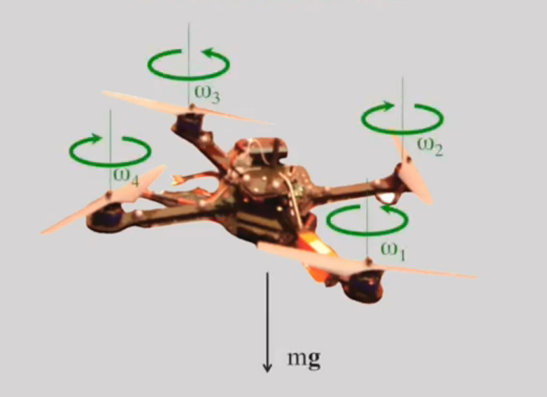
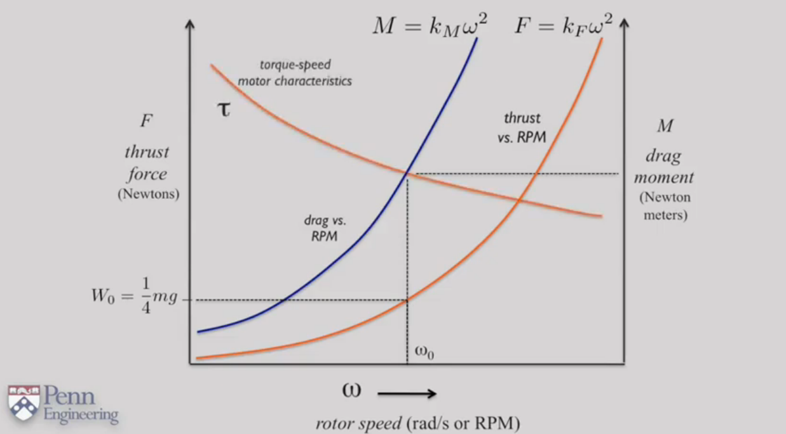
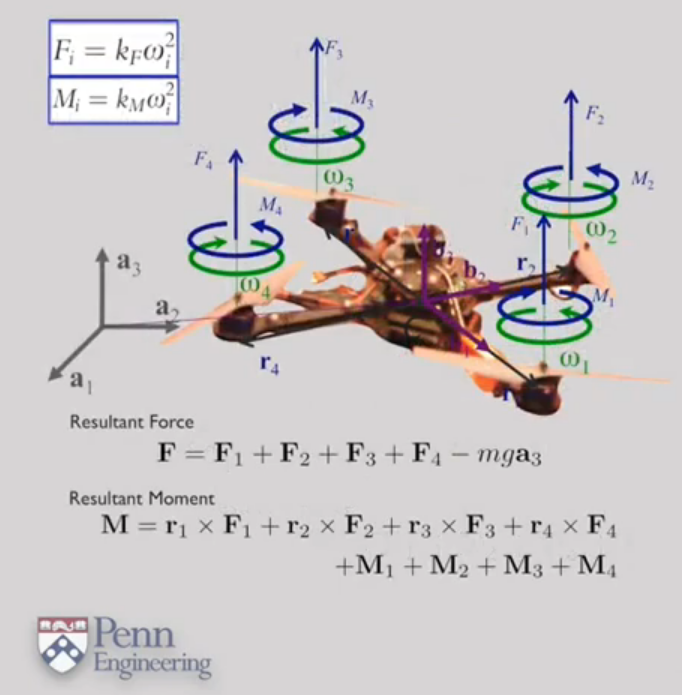

# Aerial Robotics
___
## Day 1

### 1.3 Key Components

В каждой автономной системе есть компоненты, необходимые для ее работоспособности

- State Estimate - оценка состояния. Способность транспортного средства оценивать свое положение, ориентацию и скорость.
- Control - способность системы вычислять команды управления в зависимости от того, куда ему надо двигаться.
- Mapping - тс должно обладать базовой способностью составлять карту окружающей среды.
- Planning - имея набор препятствий и пункт назначения, тс должно уметь строить безопасный путь.

### 1.4 State Estimation

**Цель - получить достоверные оценки положения и скорости тс по мере его движения в окружающей среде**

Чтобы определять свое положение (тс), мы можем использовать GPS. Но в замкнутых помещениях, и работая с дронами, GPS не дает настолько хорошей оценки. Поэтому мы должны использовать что-то, помимо него. Например, камеры глубины, RGB камеры, и лазерные дальномеры.

Вопрос, который мы задаем. Может ли робот одновременно оценивать местоположение опор и изменение смещения по оси? Мы пытаемся локализоваться.

Эта проблема называется одновременной локализацией отображения или просто SLAM:
S - Simultaneous
L - Localization
A - And
M - Mapping

Но увеличение датчиков увеличивает вес дрона, следовательно необходимую мощность двигателей и потребление энергии. Для этого в лаборатории сделали дрон с 1 камерой, но придумали AruCo метки, по которым дрон может ориентироваться.
___

## Day 2

### 1.5 Applications

**Применение дронов в реальной жизни**
1. *Агрохозяйство*. Для отслеживания роста культур, их жизнедеятельности.
2. *Строительная область*. Отслеживать процесс строительства, постройка 3 мерных карт объекта.
3. *Археология*
4. *Аэросъемка*
5. *Дроны быстрого реагирования*. Разведка, построение 3д карты интересующей местности.

### 2.1 Basic Mechanics

У квадрокоптера 4 ротора, которые создают тягу, удерживая вес дрона.
___

*График зависимости тяги или силы тяги от частоты вращения двигателя или угловой скорости*

Эта зависимость приблизительно квадратична. Также возникает сопротивление, каждый раз, когда вращается ротор. Каждый ротор в квадрокоптере должен поддерживать примерно 1/4 веса дрона в равновесии. Поэтому по графику мы можем определить рабочую скорость вращения ротора. Необходимо подобрать двигатель, с крутящим моментом, который сможет преодолеть момент сопротивления.

___

Когда робот зависает, скорость вращения роторов компенсирует вес дрона.

$$k_Fw_i^2 = \frac{1}{4} mg$$

Используя эту формулу мы можем определить рабочую скорость для каждого ротора. А значит покажет, какой крутящий момент надо приложить к каждому двигателю.

$$\tau_i = k_Mw_i^2 $$

___

Мы можем рассчитать результирующую силу и результирующий момент. В состоянии равновесия они равны 0, но что будет если эти величины будут отличны от 0?

Возникнет ускорение, если сила и момент > 0, тогда возникнет ускорение, направленное вверх. В ином случае возникнет ускорение, направленное вниз.

