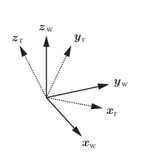
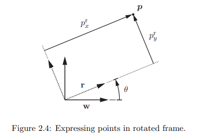

# VNAV
___

## [Lec1_VNAV](../lecture/Lec_1.pdf)

Цели VNAV

Теория
- Учить, развивать, тренировать необходимые инструменты, необходимые для робототехники (геометрия, оптимизация)
- Учить об ультрасовременных (SOTA) алгоритмов восприятия. (+ выбранные темы в контроле, оптимизации управлении, обучении)
- Обзор нерешенных проблем в области робототехнического восприятия

Практика
- ROS (Robot Operating System)
- Тщательное тестирование СОТА реализаций восприятия, контроля, ML в фото-реалистичных симуляторах
- Ограничения SOTA реализаций

## [Lec2-3_VNAV](../lecture/Lec_2-3.pdf)

Эта лекция покрывает такие темы как
- система координат (coordinate frames)
- позицирование и перемещение (positions and translations)
- относительное представление (attitude represantation)
- (pose representation)

### 2.1 Coordinate Frames

Система координат - это набор осей, прикрепленных к телу, необходимые для описания положения точек относительно тела. Оси сходятся в одной точке, называемой началом координат.
В этом курсе мы будем использовать системы координат:
- Нашего робота (robot frame 'r')
- Каждого датчика нашего робота (e.g camera frame 'c')
- Глобальная система координат (world frame 'w')
- Других тел

В робототехнике используют правую тройку векторов.

Робот
- Начало координат - центр масс
- Ось хr вперед, yr влево, zr вверх

Camera 3D
- Начало координат - центр камеры
- Ось xc вправо, ус вниз, zc смотрит на сцену

Camera 2D
- Начало координат - Верхний левый угол изображения
- Ось. Смотря на изображение: xc вправо, ус вниз.
___

### 2.2 Points, positions, and translations

Преимущество использования системы отсчета заключается в том, что она позволяет использовать линейную алгебру для представления точек. Например, мы можем представить точку ***p*** относительно глобальной системы координат "w" используя 3Д вектор

$$
\boldsymbol{p}^w = \begin{bmatrix}
   p_x^w \\
   p_y^w \\
   p_z^w
\end{bmatrix}
$$

где $p_x^w, \ p_y^w, \ p_z^w \in R$ скалярные величины, называемые координатами точки ***p*** в глобальной системе координат. Также эти координаты являются проекциями точки *p* на оси $x_w,\ y_w,\ z_w$ глобальной системы отсчета.

Мы также используем линейную алгебру для подсчета перемещения или *сдвига* между точками $p_1 \ \text{и} \ p_2$:

$$p_{12}^w=p_2^w-p_1^w \ (2.2)$$

Или, аналогично,  посчитать позицию $p_2$ имея $p_1$ и перемещение $p_{12}^w$:

$$p_{2}^w=p_1^w+p_{12}^w \ ("composition") \ (2.3)$$

$$p_{12}^w=-p_{21}^w \ ("inverse") \ (2.4)$$

Векторы не имеют значения, если мы не зададим систему координат для этих векторов.

В частности мы будем представлять позиции и перемещения использя вектор в $R^d$, где $d = 2$ для плоскостных вопросов и $d = 3$ для трехмерных вопросов.

### 2.3 Attitude and rotations.(положение и повороты)

Для описания положения тел следует использовать инструменты из предыдущей секции. В робототехнике нас интересуют модели, которые могут занимать произвольную позицию и ориентацию (**orientaions**)

Мы имеем дело с твердыми телами, положение которых описываем с помощью систем координат. В этой секции мы задаемся вопросом, как мы можем 
*represent the orientation of a frame*?

Термины **orientation**, **attitude**, **rotation**  взаимозаменяемы и используются для описания положения тела в пространстве.

#### 2.3.1 Rotation matrix representation

Очень простой способ представить положение системы r относительно системы w: 

**Note** 
`Рассмотрим конец каждой оси xr, yr, zr как точку и расположим координаты каждой точки относительно системы координат w в виде столбцов матрицы.`

##### Example 2.3.1 (2D rotation matrix)

В плоском примере видно, что координаты вершин оси xr относительно системы w равны: 

$$
R_r^w = \begin{bmatrix} 
\cos(\theta) & -\sin(\theta) \\ 
\sin(\theta) & \cos(\theta) 
\end{bmatrix}
$$

##### Example 2.3.2 (3D rotation matrix)

Как и в предыдущем примере, мы можем представить матрицу заполнив каждый столбец координатами осей системы r выраженных относительно системы w

$$
R_r^w = \begin{bmatrix} x_r^w & y_r^w & z_r^w \end{bmatrix}
$$

$R_r^w$ - rotation matrix (матрица поворота)

Это не общая матрица, ее столбы представляют *ортогональные оси единичной длины удовлетворяющие правилу правой руки* поэтому любая матрица поворотов должна обладать следующими свойствами:

- **orthogonality:**  

$$
\begin{aligned}
\|x_r^w\|_2^2 &= 1 & \|y_r^w\|_2^2 &= 1 & \|z_r^w\|_2^2 &= 1 \ \text{(unit length) (2.7)} \\
(x_r^w)^\top y_r^w &= 0 & (x_r^w)^\top z_r^w &= 0 & (y_r^w)^\top z_r^w &= 0 \ \text{(orthogonal vectors) (2.8)} 
\end{aligned}
$$

Эти уравнения можем переписать, как:

$$
(R_r^w)^\top R_r^w = I_d \quad (\text{orthogonality}) \ (2.9)
$$

Where $I_d$ is the identity (единичная) matrix of size $d$. Such a matrix is said to be orthogonal, и удовлетворяет следующему условию:

$$
(R_r^w)^{-1} = (R_r^w)^\top \ (2.10)
$$

- **right-handedness:**

Так как наши оси ортогональны, мы можем записать их отношение через векторное произведение. (не забываем, что они единичны)

$$
x_r^w \times y_r^w = z_r^w \iff (z_r^w)^\top (x_r^w \times y_r^w) = +1 \iff \det(R_r^w) = +1
$$

Для 3 векторов $a, b, c \in \mathbb{R}^3$ верно:

$$
\begin{aligned}
a \cdot (b \times c) &= \det \left( \begin{bmatrix} a & b & c \end{bmatrix} \right) \quad \text{and} \\
a \cdot (b \times c) &= -c \cdot (b \times a) = c \cdot (a \times b)
\end{aligned}
$$

Следовательно, rotation matrix $R_r^w$ должна удовлетворять условию:

$$
\det(R_r^w) = +1 \quad (\text{determinant } +1)
$$

##### 2.3.1.1 Operations involving rotations

Теперь, когда у нас есть хотя бы 1 способ задания положения точки в пространстве, мы задаемся следующими вопросами:

- *rotation point*. У нас есть координаты точки в **r** и положение **r** в **w**. *Как нам найти координаты точки в w?*

- *composition*. У нас есть положение **r** в **w** и положение **c** в **r**. *Как нам найти положение **с** в **w**?*

- *inverse*. У нас есть положение **r** в **w**, *Как найти положение **w** в **r**?*

##### Expressing points in a rotated frame

Предположим, у нас есть координаты точки в **r**: $p^r$ и положение **r** в **w**: $R_r^w$. где **w** и **r** имеют совпадающие начала координат.

И мы считаем координаты $p^w$ точки в **w**.

$$
\boldsymbol{p}^w = \boldsymbol{R}_r^w \boldsymbol{p}^r \tag{2.15}
$$

*proof* из рис 2.4 видно, что координаты $p^w$ могут быть получены через сумму векторов

$$
\boldsymbol{p}^w = \boldsymbol{x}_r^w p_x^r + \boldsymbol{y}_r^w p_y^r + \boldsymbol{z}_r^w p_z^r = 
\begin{bmatrix} \boldsymbol{x}_r^w & \boldsymbol{y}_r^w & \boldsymbol{z}_r^w \end{bmatrix} 
\begin{bmatrix} p_x^r \\ p_y^r \\ p_z^r \end{bmatrix} 
= \boldsymbol{R}_r^w \boldsymbol{p}^r \tag{2.16}
$$

*Note*: Умножать матрицу поворота на вектор разрешается только в том случае, если нижний индекс у матрицы совпадает с верхним индексом вектора.

##### Rotation composition

Предположим, у нас есть поворот **r** in **w** namely $R_r^w$ и поворот **c** in **r**, namely $R_c^r$. Мы отвечаем на вопрос как посчитать $R_c^w$?

$$
\boldsymbol{R}_c^w = \boldsymbol{R}_r^w \boldsymbol{R}_c^r \tag{2.17}
$$

*proof*

$$
\boldsymbol{R}_r^w \boldsymbol{R}_c^r = \boldsymbol{R}_r^w \begin{bmatrix} \boldsymbol{x}_c^r & \boldsymbol{y}_c^r & \boldsymbol{z}_c^r \end{bmatrix} 
= \begin{bmatrix} \boldsymbol{R}_r^w \boldsymbol{x}_c^r & \boldsymbol{R}_r^w \boldsymbol{y}_c^r & \boldsymbol{R}_r^w \boldsymbol{z}_c^r \end{bmatrix} 
= \begin{bmatrix} \boldsymbol{x}_c^w & \boldsymbol{y}_c^w & \boldsymbol{z}_c^w \end{bmatrix} 
= \boldsymbol{R}_c^w \\ \tag{2.18} \square
$$

*Note1*: Составлять последовательность из двух матриц вращение можно только в том случае, если нижний индекс первой совпадает с верхним индексом второй

*Note2*: В общем случае rotation composition не коммуникативна, то есть: 

$$
\boldsymbol{R}_r^w \boldsymbol{R}_c^r \neq \boldsymbol{R}_c^r \boldsymbol{R}_r^w
$$