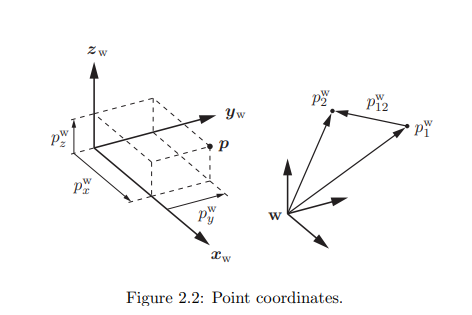

# VNAV
___

## Day 1

### [Lec1_VNAV](../lecture/Lec_1.pdf)

Цели VNAV

Теория
- Учить, развивать, тренировать необходимые инструменты, необходимые для робототехники (геометрия, оптимизация)
- Учить об ультрасовременных (SOTA) алгоритмов восприятия. (+ выбранные темы в контроле, оптимизации управлении, обучении)
- Обзор нерешенных проблем в области робототехнического восприятия

Практика
- ROS (Robot Operating System)
- Тщательное тестирование СОТА реализаций восприятия, контроля, ML в фото-реалистичных симуляторах
- Ограничения SOTA реализаций

### [Lec2-3_VNAV](../lecture/Lec_2-3.pdf)

Эта лекция покрывает такие темы как
- система координат (coordinate frames)
- позицирование и перемещение (positions and translations)
- относительное представление (attitude represantation)
- (pose representation)

#### 2.1 Coordinate Frames

Система координат - это набор осей, прикрепленных к телу, необходимые для описания положения точек относительно тела. Оси сходятся в одной точке, называемой началом координат.
В этом курсе мы будем использовать системы координат:
- Нашего робота (robot frame 'r')
- Каждого датчика нашего робота (e.g camera frame 'c')
- Глобальная система координат (world frame 'w')
- Других тел

В робототехнике используют правую тройку векторов.

Робот
- Начало координат - центр масс
- Ось хr вперед, yr влево, zr вверх

Camera 3D
- Начало координат - центр камеры
- Ось xc вправо, ус вниз, zc смотрит на сцену

Camera 2D
- Начало координат - Верхний левый угол изображения
- Ось. Смотря на изображение: xc вправо, ус вниз.
___

## Day 2

#### 2.2 Points, positions, and translations

Преимущество использования системы отсчета заключается в том, что она позволяет использовать линейную алгебру для представления точек. Например, мы можем представить точку ***p*** относительно глобальной системы координат "w" используя 3Д вектор

$$
\boldsymbol{p}^w = \begin{bmatrix}
   p_x^w \\
   p_y^w \\
   p_z^w
\end{bmatrix}
$$

где $p_x^w, \ p_y^w, \ p_z^w \in R$ скалярные величины, называемые координатами точки ***p*** в глобальной системе координат. Также эти координаты являются проекциями точки *p* на оси $x_w,\ y_w,\ z_w$ глобальной системы отсчета.

Мы также используем линейную алгебру для подсчета перемещения или *сдвига* между точками $p_1 \ \text{и} \ p_2$:

$$p_{12}^w=p_2^w-p_1^w \ (2.2)$$

Или, аналогично,  посчитать позицию $p_2$ имея $p_1$ и перемещение $p_{12}^w$:

$$p_{2}^w=p_1^w+p_{12}^w \ ("composition") \ (2.3)$$

$$p_{12}^w=-p_{21}^w \ ("inverse") \ (2.4)$$

Векторы не имеют значения, если мы не зададим систему координат для этих векторов.

В частности мы будем представлять позиции и перемещения использя вектор в $R^d$, где $d = 2$ для плоскостных вопросов и $d = 3$ для трехмерных вопросов.

